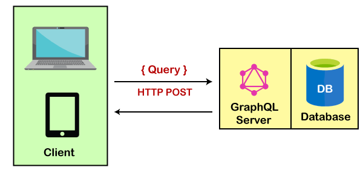
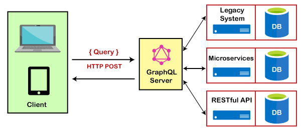
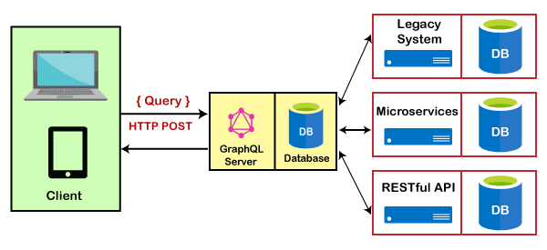

# GraphQL Architecture

_Before deep dive into GraphQL architecture let's discuss some key points about GraphQL -_

- GraphQL is a specification provided by Facebook for faster API performance.
- It provides faster performance by limiting HTTP requests.
- GraphQL reduces the size of the payload(data) sent to the server.
- As compared to REST architecture, GraphQL provides specific data to the user neither less nor more.

### Why we use Graphql

- It provides us with the approach to developing web APIs.
- It allows us to define the structure of data according to our project.
- It provides the facility to define common data schema between client and server.
- It is neutral to any database we can use SQL or NoSQL. Graphql does not care about it.
- It is more stable because it provides data validation and type checking.

### Common architecture of Graphql server

1. Graphql with the connected database.
2. Graphql Server Integrating Existing system
3. Hybrid Approach that contains the functionality of the connected database system and integrates the existing system.

## Graphql with connected database

- In this architecture Graphql server has an integrated database.
- After receiving the request query from the client, it reads the data from the request query and fetches data from the database, and sends a response with data to the client.
- It is mostly used in new projects that have simple functionality.

  

this diagram clearly shows that the Graphql server and database are working together as a single unit.

## Graphql Server Integrating Existing system

- This architecture is used to combine third-party APIS, microservice, etc in the existing system.
- It acts as an interface between the client and existing systems.
- In this architecture client queries are resolved by retrieving data from third-party APIs.
- This architecture is mostly used by those companies that have very complicated systems
  
  This diagram shows that the GraphQL server works as an intermediatory between frontend and backend services.

## Hybrid Approach

- This architecture is a combination of connected database systems and integrating existing systems.
- Whenever the server receives a request from the client it can retrieve data from the database as well as from third-party APIs also.

This diagram clearly shows that GraphQL works as an Interface between client and other backend services. It provides a central endpoint between client and backend services. So the complexity is reduced.

### Advantages of GraphQL

- We can fetch data from the single API call which reduces the time very much.
- It supports data validation and types checking out-of-the-box so the developer does not need to care for the same thing.
- It provides a detailed error message if something went wrong with the server while operating.
- It solves the efficiency problem that the REST has by providing specific data.
- Reduces the complexity of the system by proving a single point for simple as well as complex systems.

### Disadvantage of GraphQL

- GraphQL doesn't support the file uploading feature yet.
- GraphQL doesn't support caching functionality yet that is mostly used in web applications for storing information.
- GraphQL performances slightly down whenever we try to perform too many complex queries for example a query that has a very nested query inside.
- Learning GraphQL is difficult as compared to others.

## References

- [Tutorialspoint](https://www.tutorialspoint.com/graphql/graphql_architecture.htm)

* [Javatpoint](https://www.javatpoint.com/graphql-architecture)

* [Altexsoft](https://www.altexsoft.com/blog/engineering/graphql-core-features-architecture-pros-and-cons/)
    